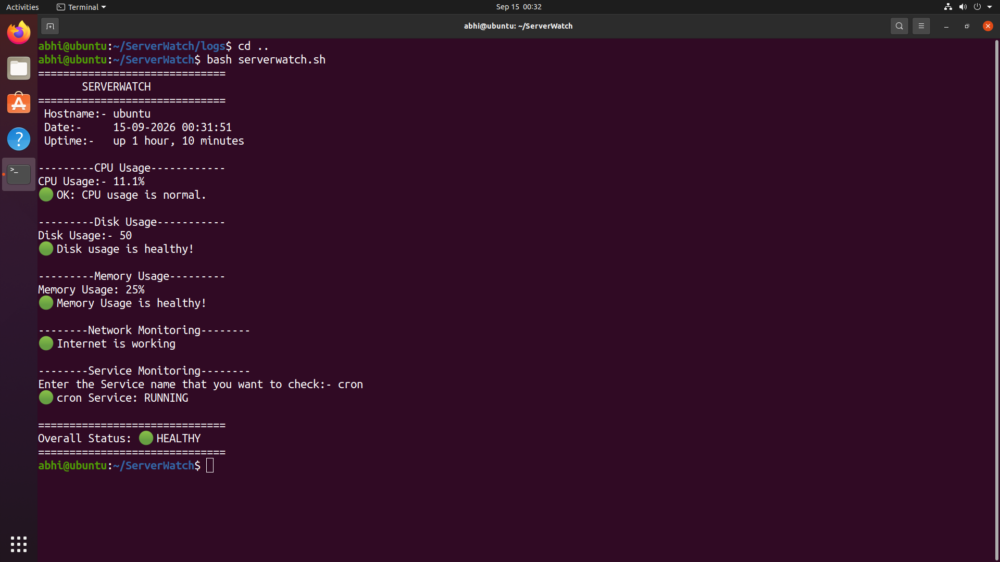
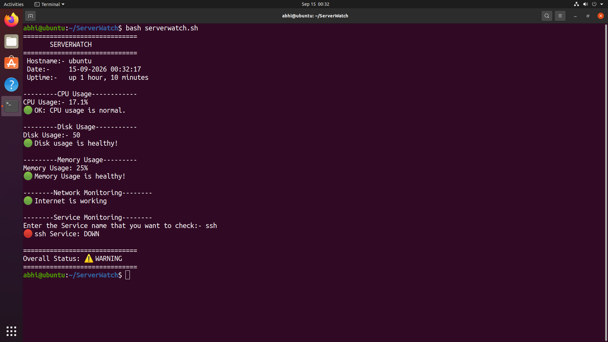
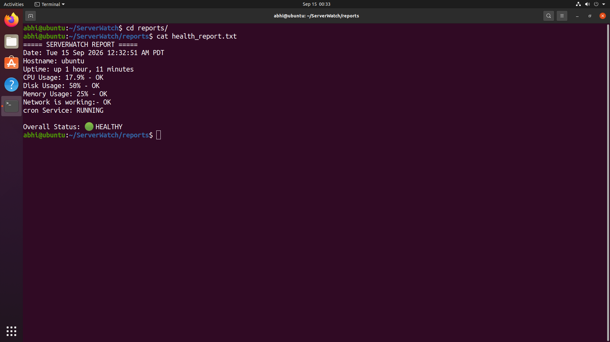
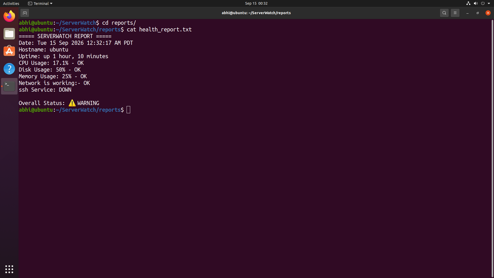
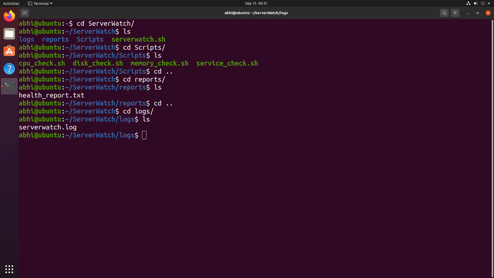

# 🖥️ ServerWatch

**ServerWatch** is a beginner-friendly Linux server monitoring tool built with **Bash scripting**. It checks essential server resources and services and provides a simple health status.

> 🚀 **Version 1.0 — Linux Server Monitoring with Bash**

---

## 📌 Features

ServerWatch V1 monitors:

* 🧠 **CPU Usage**
* 💾 **Memory Usage**
* 💽 **Disk Usage**
* ⏱️ **Server Uptime**
* 🌐 **Network Connectivity**
* ⚙️ **Service Status**
* 📋 **Health Status**
* 📝 **Log Generation**
* ⏰ **Cron Automation**

---

## 🎯 Project Objective

The goal of ServerWatch is to build a simple server monitoring system while learning practical **Linux, Bash, and DevOps** concepts.

The project checks the server periodically and identifies whether important resources and services are operating normally.

---

## 🖼️ Project Screenshots

### ServerWatch Output




### Health Report




### ServerWatch Project Structure



---

## 📂 Project Structure

```text
ServerWatch/
│
├── serverwatch.sh
│
├── scripts/
│   ├── cpu_check.sh
│   ├── memory_check.sh
│   ├── disk_check.sh
│   └── service_check.sh
│
├── logs/
│   └── serverwatch.log
│
├── reports/
│   └── health_report.txt
│
├── images/
│   ├── serverwatch-output.png
│   ├── health-report.png
│   └── project-structure.png
│
└── README.md
```

### File Description

| File / Directory  | Description                   |
| ----------------- | ----------------------------- |
| `serverwatch.sh`  | Main monitoring script        |
| `scripts/`        | Individual monitoring scripts |
| `logs/`           | Stores monitoring logs        |
| `serverwatch.log` | Stores ServerWatch output     |
| `reports/`        | Stores health reports         |
| `images/`         | Project screenshots           |
| `README.md`       | Project documentation         |

---

## 🛠️ Requirements

Before running ServerWatch, make sure you have:

* Linux operating system
* Bash
* `top`
* `free`
* `df`
* `ping`
* `systemctl`
* Cron

Most of these commands are already available on common Linux distributions.

---

## 🚀 Installation

### 1. Clone the Repository

```bash
git clone https://github.com/Abhishek-max211/ServerWatch.git
```

### 2. Enter the Project

```bash
cd ServerWatch
```

### 3. Make the Script Executable

```bash
chmod +x serverwatch.sh
chmod +x scripts/*.sh
```

### 4. Run ServerWatch

```bash
./serverwatch.sh
```

---

## 📊 Example Output

```text
================================
          SERVERWATCH
================================

Hostname: ubuntu-server
Date: Mon Sep 14 21:40:00 IST 2026
Uptime: up 3 hours

CPU Usage: 24%
CPU: OK

Memory Usage: 51%
Memory: OK

Disk Usage: 63%
Disk: OK

Network: OK

SSH Service: RUNNING

================================
Overall Status: HEALTHY
================================
```

If a resource exceeds its configured threshold, ServerWatch reports a warning:

```text
WARNING: CPU usage is high
```

---

## 🧠 How It Works

ServerWatch follows a simple monitoring process:

```text
              Start
                │
                ▼
        Get Server Information
                │
                ▼
       ┌────────┼────────┐
       │        │        │
       ▼        ▼        ▼
      CPU     Memory    Disk
       │        │        │
       └────────┼────────┘
                ▼
         Check Network
                │
                ▼
        Check Services
                │
                ▼
        Determine Status
                │
         ┌──────┴──────┐
         ▼             ▼
      HEALTHY       WARNING
         │             │
         └──────┬──────┘
                ▼
          Save Log
                │
                ▼
               End
```

---

## ⚙️ Service Monitoring

ServerWatch can check whether important Linux services are running.

Example:

```bash
if systemctl is-active --quiet ssh
then
    echo "SSH Service: RUNNING"
else
    echo "SSH Service: DOWN"
fi
```

You can modify the script to monitor services such as:

```text
SSH
Nginx
Apache
Docker
Cron
```

depending on the services installed on your server.

---

## 📝 Logging

ServerWatch can save monitoring results to a log file.

Create the logs directory:

```bash
mkdir -p logs
```

Run the script and save its output:

```bash
./serverwatch.sh >> logs/serverwatch.log 2>&1
```

The log file can then be used to review previous health checks.

---

## 📄 Health Reports

ServerWatch can generate a health report containing important server information and monitoring results.

The report is stored in:

```text
reports/health_report.txt
```

Example:

```text
===== SERVERWATCH REPORT =====

Date: Mon Sep 15 12:00:00 IST 2026
Hostname: ubuntu-server
Uptime: up 2 hours

CPU Usage: 24% - OK
Memory Usage: 51% - OK
Disk Usage: 63% - OK
Network: OK
SSH Service: RUNNING

Overall Status: HEALTHY
```

---

## ⏰ Cron Automation

ServerWatch can automatically run using **Cron**.

Open the crontab:

```bash
crontab -e
```

To run ServerWatch every day at **12:00 AM**:

```cron
0 0 * * * /home/ubuntu/ServerWatch/serverwatch.sh >> /home/ubuntu/ServerWatch/logs/serverwatch.log 2>&1
```

### Cron Structure

```text
0 0 * * * command
│ │ │ │ │
│ │ │ │ └── Day of week
│ │ │ └──── Month
│ │ └────── Day of month
│ └──────── Hour
└────────── Minute
```

---

## 📚 Linux Commands Used

ServerWatch uses practical Linux commands such as:

```bash
hostname
date
uptime
top
free
df
ping
systemctl
awk
grep
```

---

## 🧠 Bash Concepts Practiced

This project helps practice:

* Variables
* Command substitution
* `if/else`
* Comparison operators
* Exit status
* Pipes
* `awk`
* `grep`
* Loops
* Functions
* Output redirection
* File permissions
* Cron jobs
* Basic error handling

---

## 🔐 Health Thresholds

ServerWatch uses thresholds to identify potential problems.

Example:

| Resource |    Normal |      Warning |
| -------- | --------: | -----------: |
| CPU      |     ≤ 80% |        > 80% |
| Memory   |     ≤ 80% |        > 80% |
| Disk     |     ≤ 80% |        > 80% |
| Network  | Connected | Disconnected |
| Service  |   Running |      Stopped |

These values can be customized in future versions.

---

## 🔮 Future Improvements

### Version 2.0

Planned improvements:

* Configuration file
* Better functions and modular scripts
* Process monitoring
* Improved service monitoring
* Better error handling
* Detailed reports
* Custom thresholds

### Version 3.0

* 📧 Email alerts
* 🖥️ Multiple server monitoring
* 🔐 Remote monitoring using SSH
* 📊 Automated reports

### Version 4.0

* 🐳 Docker integration
* 📈 Prometheus
* 📊 Grafana
* 🚨 Alertmanager
* ☁️ AWS EC2 monitoring
* 🌐 Web dashboard

---

## 🎓 Learning Outcomes

By building ServerWatch, you will gain practical experience with:

* Linux system administration
* Bash scripting
* Server resource monitoring
* Linux services
* Log management
* Cron automation
* Git and GitHub
* Basic DevOps practices

---

## 🤝 Contributing

Contributions and suggestions are welcome.

If you have an idea for improving ServerWatch:

1. Fork the repository.
2. Create a new branch.
3. Make your changes.
4. Commit your changes.
5. Create a Pull Request.

---

## 👨‍💻 Author

**Abhishek Pundir**

Learning and building with:

**Linux • Bash • DevOps • Cloud • AWS**

---

## ⭐ Project Status

**🟢 ServerWatch V1 — Completed**

A simple beginning toward building a complete server monitoring and DevOps platform.

If you find this project useful, consider giving the repository a ⭐.

